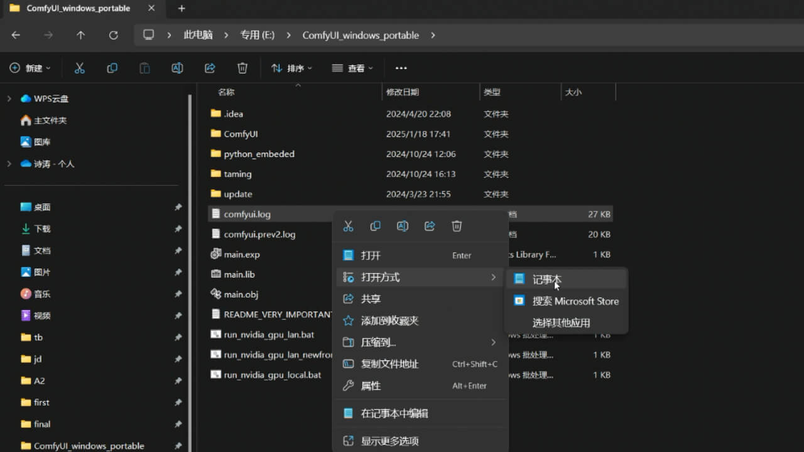
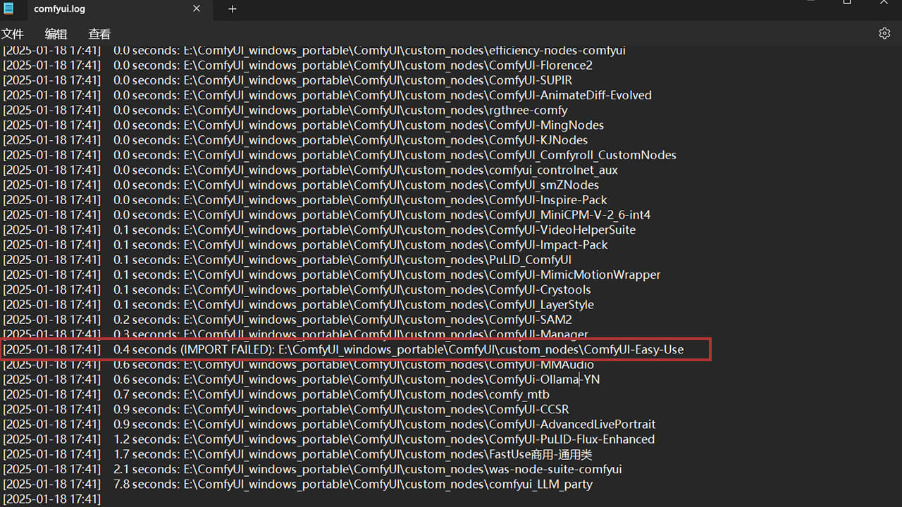
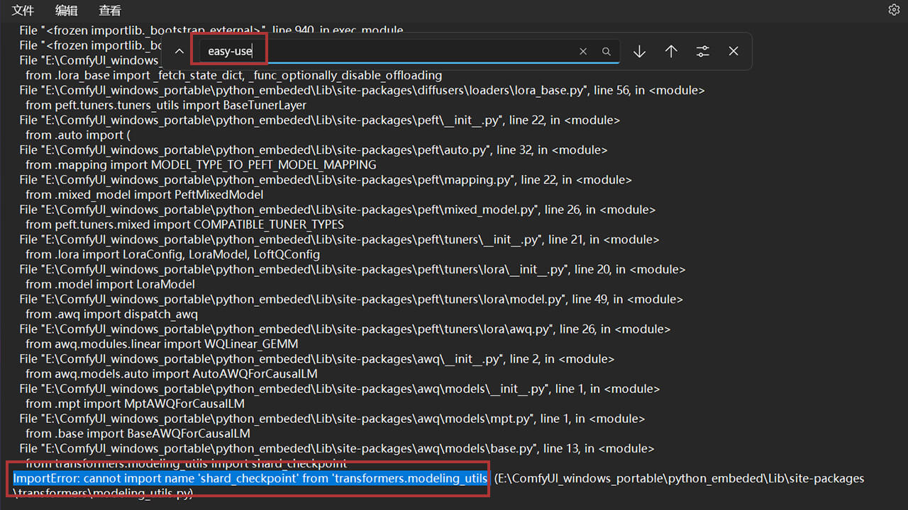
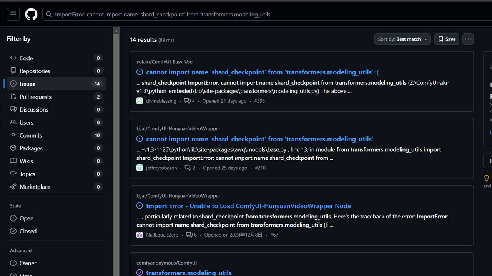
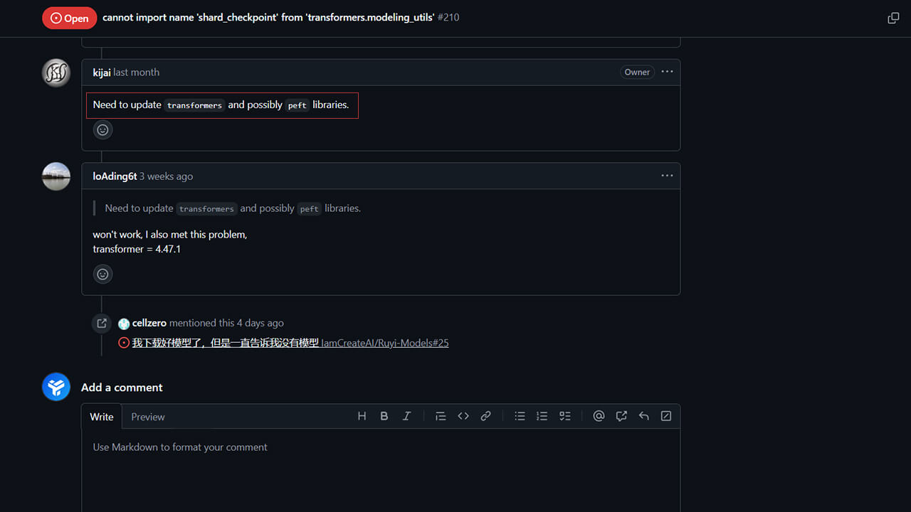

<Steps>
  <Step title="Install Node Package" >
    <AccordionGroup>
      <Accordion title="Install via Git Command">
        #### 1. Install Git
        If Git is not installed on your computer, please install Git first. Git is a distributed version control system used to track changes in files. You can download the Git installer suitable for your operating system from the [Git official website](https://git-scm.com/downloads).

        #### 2. Clone EasyUse to Local
        <Tabs>
          <Tab title="Windows">
            - Navigate to the `ComfyUI/custom_nodes` folder
            - In the search box above the folder, type `cmd` and press Enter to launch the command line tool
            - Enter the following command in the command line tool to download the EasyUse node package
            ```shell
            git clone https://github.com/yolain/ComfyUI-Easy-Use
            ```
          </Tab>
          <Tab title="Linux (Cloud Platform)">
            - Navigate to the `ComfyUI/custom_nodes` folder
            - Find the command line/terminal tool in the right panel
            - Enter the following command to download the EasyUse node package
            ```shell
            git clone https://github.com/yolain/ComfyUI-Easy-Use
            ```
          </Tab>
          <Tab title="MacOS">
            - Run Terminal from `Applications/Utilities` or `Spotlight Search`
            - Find the `ComfyUI/custom_nodes` folder, press `Option` + `Command` + `C` to copy the path
            - Enter the following command to download the EasyUse node package
            ```shell
            # Paste the path after cd
            cd path
            git clone https://github.com/yolain/ComfyUI-Easy-Use
            ```
          </Tab>
        </Tabs>
      </Accordion>
      <Accordion title="Install via ComfyUI Manager" >
        - After running ComfyUI, click `Manager` at the top of the web interface to find `Custom Nodes Manager`
        - Search for `ComfyUI Easy Use` and click `Install`
        - Restart ComfyUI to apply the changes
      </Accordion>
      <Accordion title="Install via Third-Party Launcher" >
        - Run a third-party launcher, such as `Aki Launcher`
        - Search for `ComfyUI Easy Use` in the launcher's node management and click `Install`
      </Accordion>
    </AccordionGroup>
  </Step>

  <Step title="Install Required Dependencies" >
      <Note>Some cloud platforms (Linux environments) use Miniconda. If you need to update dependencies, please refer to the third option.</Note>
      <AccordionGroup>
        <Accordion title="Official Desktop Version">
          No additional dependencies are required, as all necessary dependencies are already included in the official version.
        </Accordion>
        <Accordion title="System Python or ComfyUI_windows_portable or Integrated Package">
            <Tabs>
              <Tab title="Windows">
                - Navigate to the `ComfyUI/custom_nodes/ComfyUI-Easy-Use` folder
                - Run the `install.bat` file to install dependencies
              </Tab>
              <Tab title="Linux/MacOS">
                - Run Terminal from `Applications/Utilities` or `Spotlight Search`
                - Find the `ComfyUI/custom_nodes` folder, press `Option` + `Command` + `C` to copy the path
                - Enter the following command to install dependencies
                ```shell
                # Paste the path after cd
                cd path
                sh ./install.sh
                ```
              </Tab>
            </Tabs>
        </Accordion>
        <Accordion title="Miniconda / Anaconda">
          <Tabs>
            <Tab title="Windows">
              - Navigate to the `ComfyUI/custom_nodes` folder
              - In the search box above the folder, type `cmd` and press Enter to launch the command line tool
              - Enter the following command to activate the conda virtual environment and install dependencies
              ```shell
                # Assuming the current virtual environment name is comfyui
                conda activate comfyui
                pip install -r requirements.txt
              ```
            </Tab>
            <Tab title="Linux/MacOS">
              - Run Terminal from `Applications/Utilities` or `Spotlight Search`
              - Find the `ComfyUI/custom_nodes` folder, press `Option` + `Command` + `C` to copy the path
              - Enter the following command to activate the conda virtual environment and install dependencies
              ```shell
                # Assuming the current virtual environment name is comfyui
                conda activate comfyui
                pip install -r requirements.txt
              ```
            </Tab>
          </Tabs>
        </Accordion>
      </AccordionGroup>
  </Step>

  <Step title="Resolve Dependency Conflicts (Optional)" >
    If EasyUse still fails to load after completing the first two steps and running ComfyUI, it is usually due to dependency conflicts. You can try the following methods to troubleshoot the issue:

    `1. Check ComfyUI Run Logs`
     - After running ComfyUI, you can find the `comfyui.log` and `comfyui.prev.log` files in the root directory. Open them with a text editor to check for error messages related to Easy-Use (the same method applies to other node packages).
     <Frame caption="1-1. Open the comfyui.log file in the root directory with a text editor">
     
     </Frame>
     <br/>
     <Frame caption="1-2. This section only shows the startup results of various node packages. You can see that EasyUse failed to load, but the reason is not visible">
     
     </Frame>
     <br/>
     <Frame caption="1-3. Search for easy-use to find related error reasons, and copy the error content">
     
     </Frame>
    `2. Search for Related Issues on GitHub or Ask GPT or Ask the Developer on GitHub`
     <Frame caption="2-1. Search for related issues on GitHub">
     
     </Frame>
     <br/>
     <Frame caption="2-2. Found a solution, need to update the `peft` dependency">
     
     </Frame>
  </Step>

</Steps>