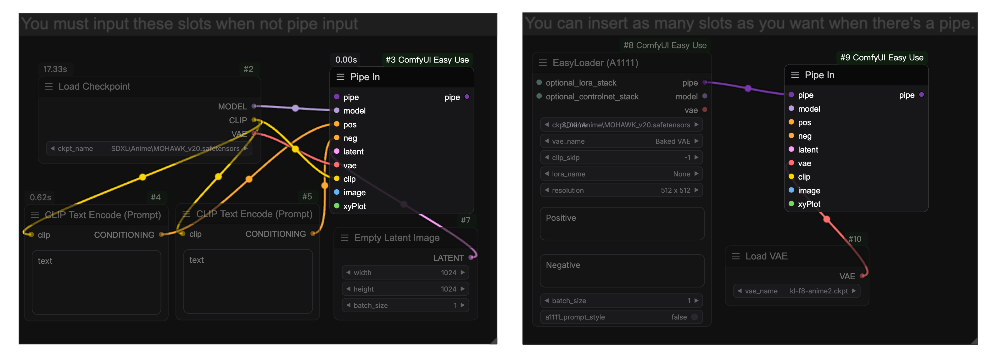
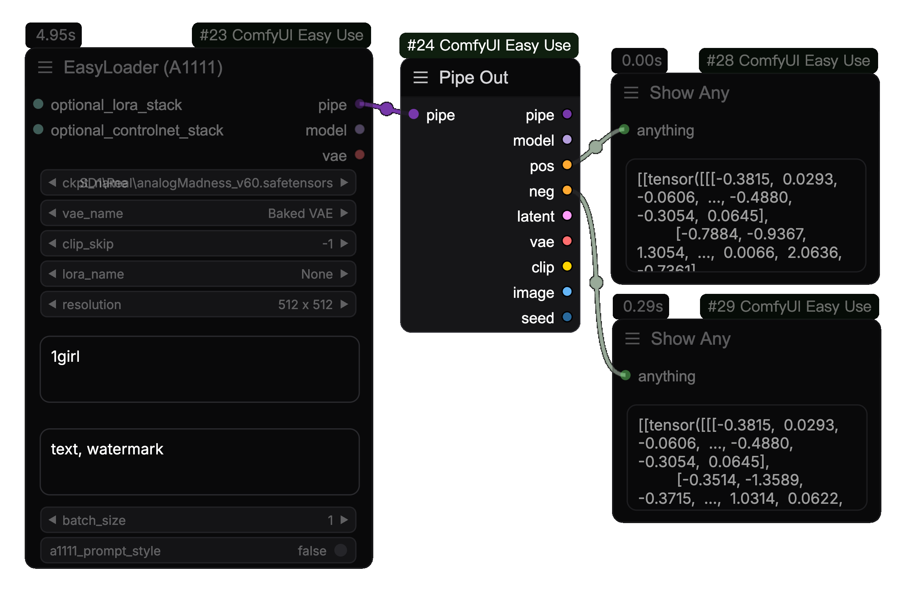

<Frame caption="Simple text to image generation with Comfyui-Easy-Use nodes">

</Frame>
[ComfyUI-Easy-Use](https://github.com/yolain/comfyui-easy-use) is an efficiency custom nodes integration package, which is extended on the basis of [TinyTerraNodes](https://github.com/TinyTerra/ComfyUI_tinyterraNodes). It has been integrated and optimized for many popular awesome custom nodes to achieve the purpose of faster and more convenient use of ComfyUI. While ensuring the degree of freedom, it restores the ultimate smooth image production experience that belongs to Stable Diffusion.

<CardGroup cols={2}>
<Card title="How to installation" icon="download" href="./installation">
Learn how to install ComfyUI-Easy-Use
</Card>
<Card title="Use Hotkeys" icon="keyboard" color="#f7b245" href="./hotkey">
Some hotkeys to make your workflow
</Card>
<Card title="Swaps Nodes" icon="retweet" color="#ff6eeb" href="./swap">
Swap same category of nodes
</Card>
<Card title="Nodes Intro" icon="code" color="#55D799" href="../nodes/loaders">
Learn more about the nodes
</Card>
</CardGroup>

## 🧐 What's different about easy pipeline and native flow?
The pipeline here is different from the diffusers pipeline. easyuse's pipeline is just an integration optimisation of the native nodes, using the same comfy native architecture.

### 1️⃣ Text To Image
<Tabs>
  <Tab title="Native Flow">
  <Note>You need 7 nodes to implemente it.</Note>
  ```mermaid
    flowchart LR
      CKPT[Load Checkpoint] -- clip --> TE[Clip Text Encode] -- conditioning --> Ksampler
      CKPT[Load Checkpoint] -- clip --> TE2[Clip Text Encode] -- conditioning --> Ksampler
      CKPT[Load Checkpoint] -- model --> Ksampler
      CKPT[Load Checkpoint] -- vae --> VD[VAE Decode]
      EmptyLatent[Empty Latent] -- latent --> Ksampler
      Ksampler -- latent --> VD[VAE Decode]
      VD[VAE Decode] -- images --> Preview
  ```
  </Tab>
  <Tab title="EasyUse Pipeline Flow">
  <Note>You only need 2~3 nodes to implemente it.<br/>In general,using method2 is more conducive to make workflows.</Note>
  ```mermaid
    flowchart TB
      subgraph Method2
        direction LR
        EL["EasyLoader (*)"] -- pipe --> EPK["PreSampling"] -- pipe --> EK["Easy KSampler"]
      end
      subgraph Method1
        direction LR
        ELF["EasyLoader (Full)"] -- pipe --> EKF["EasyKSampler (Full)"]
      end
  ```

  **EasyLoader**: Load the checkpoint model and clip encoding the text and set an empty latent. you also using load lora models and set clip skip in here. [See all loaders nodes](../nodes/loaders)<br />
  **PreSampling**: This is a separate node from ksampler, which only does the configuration of the sampling parameters and does not sample. [See all preSampling nodes](../nodes/preSampling)<br />
  **EasyKSampler**: Only sampling and vae decoding are performed, and the sampling parameters are passed in from the pre-sampling node, making it easier to observe the denoising process. [See all kSampler nodes](../nodes/kSamplers)<br />

  </Tab>
</Tabs>

### 2️⃣ Image To Image
<Tabs>
  <Tab title="Native Flow">
  ```mermaid
    flowchart LR
      CKPT[Load Checkpoint] -- clip --> TE[Clip Text Encode] -- conditioning --> Ksampler
      CKPT[Load Checkpoint] -- clip --> TE2[Clip Text Encode] -- conditioning --> Ksampler
      CKPT[Load Checkpoint] -- model --> Ksampler
      CKPT[Load Checkpoint] -- vae --> VD[VAE Decode]
      LM[Load Image] -- vae --> VE[VAE encode] -- latent --> Ksampler
      Ksampler -- latent --> VD[VAE Decode]
      VD[VAE Decode] -- images --> Preview
  ```
  </Tab>
  <Tab title="EasyUse Pipeline Flow">
  ```mermaid
    flowchart LR
      EL["EasyLoader (*)"] -- pipe --> EPK["PreSampling"] -- pipe --> EK["Easy KSampler"]
      LM[Load Image] -- image --> EPK["PreSampling"]
  ```
  pre-sampling converts the pixel image passed in by load-image node into a latent space image.
  </Tab>
</Tabs>

### 3️⃣ Using with Controlnet
<Tabs>
  <Tab title="Native Flow">
  ```mermaid
    flowchart LR
      CKPT[Load Checkpoint] -- clip --> TE[Clip Text Encode]
      CKPT[Load Checkpoint] -- clip --> TE2[Clip Text Encode]
      TE -- conditioning --> CN[Apply ControlNet] -- conditioning --> Ksampler
      TE2 -- conditioning --> CN[Apply ControlNet]
      EmptyLatent[Empty Latent] -- latent --> Ksampler
      CNL[ControlNet Loader] -- controlnet --> CN[Apply ControlNet]
      LM[Load Image] -- image --> PE[PreProcessing] -- image --> CN[Apply ControlNet]
      CKPT[Load Checkpoint] -- model --> Ksampler
      CKPT[Load Checkpoint] -- vae --> VD[VAE Decode]
      Ksampler -- latent --> VD[VAE Decode]
      VD[VAE Decode] -- images --> Preview
  ```
  </Tab>
  <Tab title="EasyUse Flow">
  ```mermaid
      flowchart LR
        subgraph Method3
          direction LR
          LM3[Load Image] -- image --> PE3[PreProcessing] -- image --> EC3[ControlNetStack] -- cnet_stack --> ACN["ApplyControlNetStack"]
          EL3["EasyLoader (*)"] -- pipe --> ACN["ApplyControlNetStack"] -- pipe --> EPK3["PreSampling"] -- pipe --> EK3["Easy KSampler"]
        end
        subgraph Method2
          direction LR
          LM[Load Image] -- image --> PE[PreProcessing] -- image --> EC[ControlNetStack] -- optional_controlnet --> EL["EasyLoader (*)"]
          EL["EasyLoader (*)"] -- pipe --> EPK["PreSampling"] -- pipe --> EK["Easy KSampler"]
        end
        subgraph Method1
          direction LR
          LM2[Load Image] -- image --> PE2[PreProcessing] -- image --> EC2["Easy ControlNet"]
          EL2["EasyLoader (*)"] -- pipe --> EC2["Easy ControlNet"] -- pipe --> EPK2["PreSampling"] -- pipe --> EK2["Easy KSampler"]
        end
    ```
  </Tab>
</Tabs>


## 🧐How to unpacking pipe and combining pipe?

### Combining into a pipe

You can use the `easy pipeIn` to merge some regular types into a pipe


### Unpacking from a pipe
Use the `easy pipeOut` to output some of the regular types of output


### Modify the pipe
Use the `easy pipeEdit` or `easy pipeEditPrompt` to modify the pipe

Typically, it is used to preserve some of the parameters after the first diffusion. For the second diffusion we only need to modify some parameters and change the pre-sampling parameters.

