## Positive
<Tabs>
  <Tab title="Node Preview">
    <Frame>
    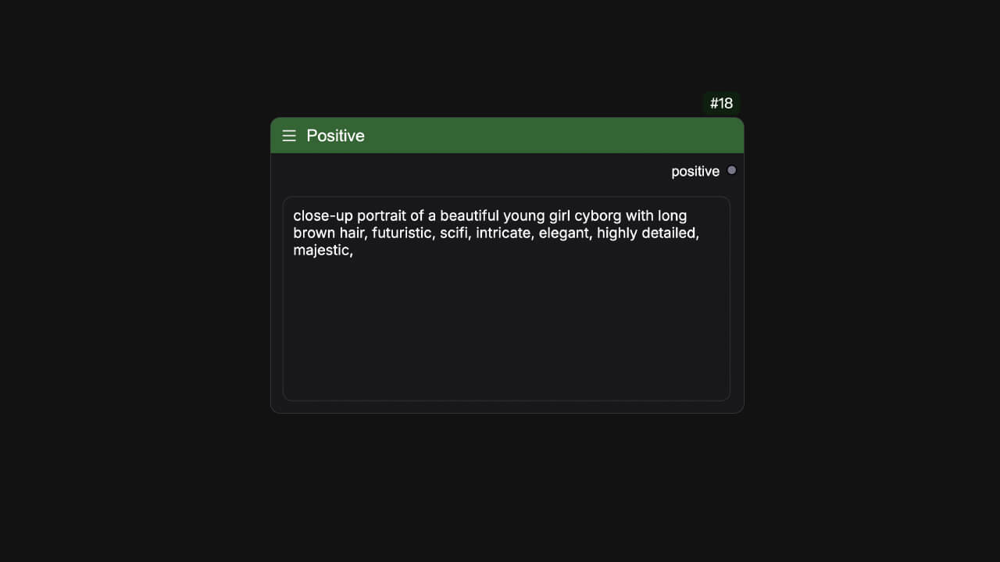
    </Frame>
  </Tab>
  <Tab title="Example">
      <Frame>
      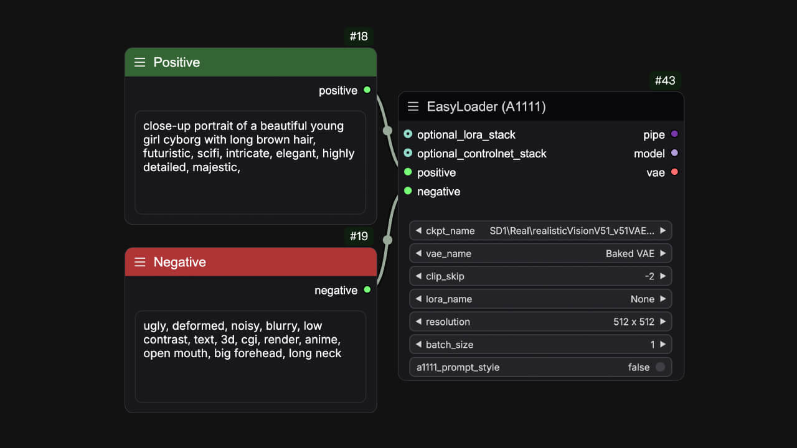
      </Frame>
  </Tab>
</Tabs>
This is a simple text node，It can be used as any text input, and in order to better distinguish between positive and negative prompts, it is marked green by default so that it can act as a positive prompt.

**Name**: `easy positive` 
**Widget**:
<ParamField path="positive" type="string">
Input your text
</ParamField>
**Output Parameters**:
<ParamField path="positive" type="string">
Output your text
</ParamField>

## Negative
<Tabs>
  <Tab title="Node Preview">
    <Frame>
    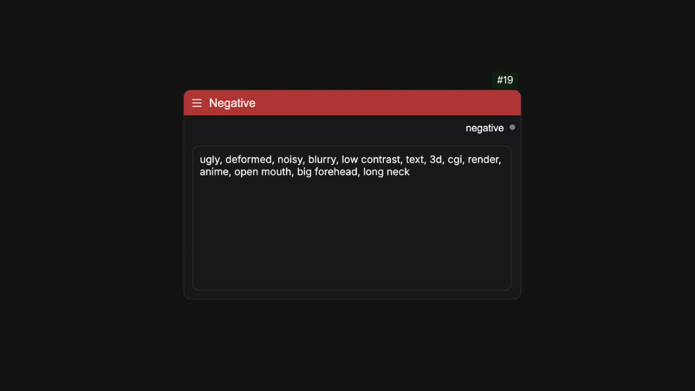
    </Frame>
  </Tab>
  <Tab title="Example">
      <Frame>
      
      </Frame>
  </Tab>
</Tabs>
This is also a simple text node too，It can be used as any text input, and in order to better distinguish between positive and negative prompts, it is marked red by default so that it can act as a negative prompt.

**Name**: `easy negative` 
**Widget**:
<ParamField path="negative" type="string">
Input your text
</ParamField>
**Output Parameters**:
<ParamField path="negative" type="string">
Output your text
</ParamField>

## Wildcards
<Tabs>
  <Tab title="Node Preview">
    <Frame>
    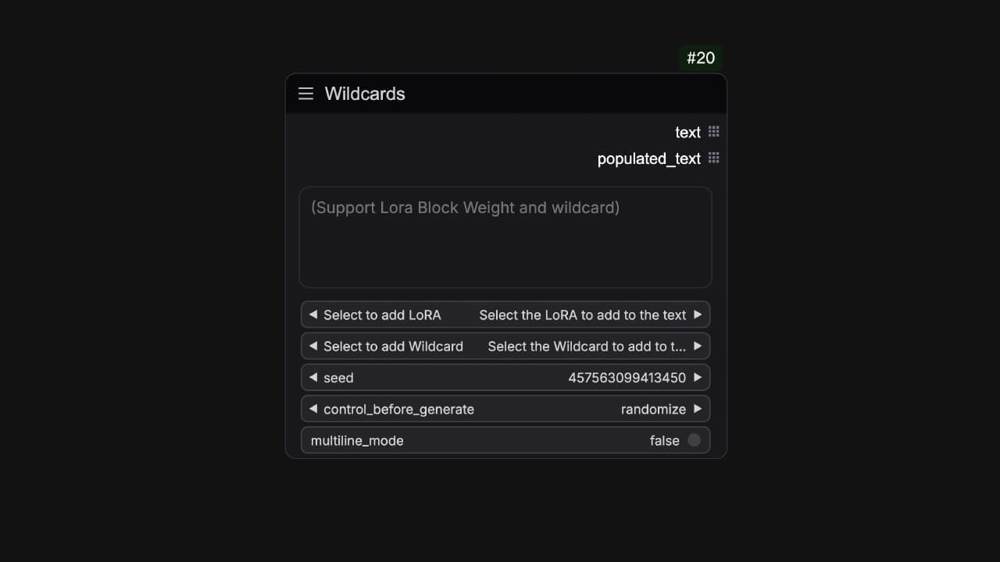
    </Frame>
  </Tab>
  <Tab title="Example">
      <Frame>
      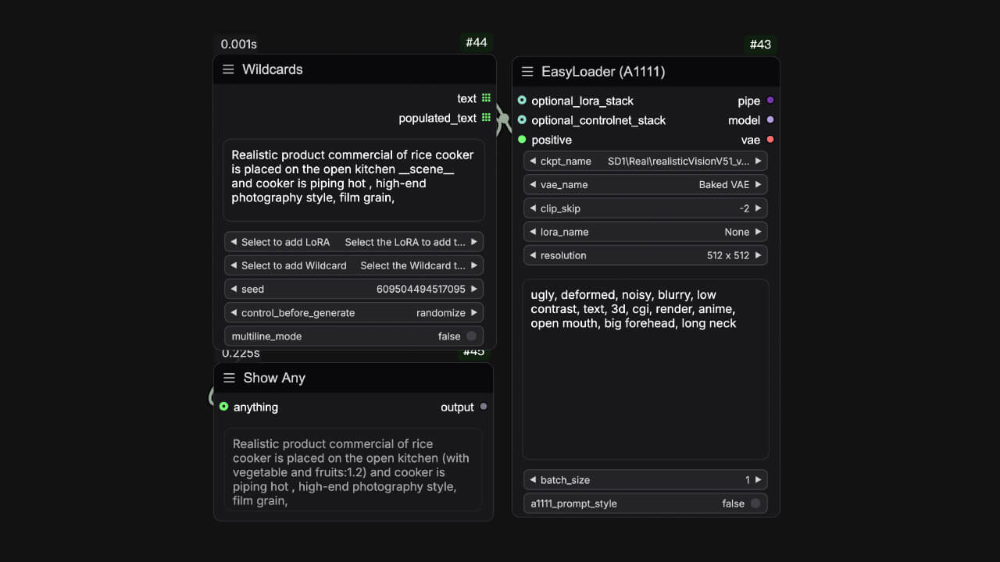
      </Frame>
  </Tab>
</Tabs>
You can associate random seeds with wildcard templates you create in the wildcards folder to get random prompt words. Of course, this node also supports the lora hint syntax.  

**Name**: `easy wildcards` 
**Widget**:
<ParamField path="text" type="string">
Input your prompt and supported some syntaxes about wildcards and lora format words.
| Supported syntaxes | Description |
| --- | --- |
| \<lora:add-detail-xl\> | \<lora:lora_name\> It will be loaded based on lora_name,and model weight is 1.0  |
| \<lora:add-detail-xl:0.5\> | \<lora:lora_name:weight\> It will be loaded based on lora_name,and model weight is 0.5  |
| \<lora:add-detail-xl:LBW=0,1,1,1,1,1,0,0,0,1,1,1\> | \<lora:lora_name:LBW=lora_block_weight\> It will load based on the lora_name, and set the lora layer weight via lora_block_weight. |
| \_\_example\_\_ | \_\_wildcard\_\_ It converts \_\_wildcard\_\_ into filled words |
</ParamField>
<ParamField path="Select to add LoRA" type="combo">
Convert the LoRA to be added into prompt word format and add it to the text. 
</ParamField>
<ParamField path="Select to add Wildcard" type="combo">
Convert the wildcard to be added into prompt word format and add it to the text. 
</ParamField>
<ParamField path="seed" type="int|seed">
Comfy's regular seed widget.
</ParamField>
<ParamField path="multiline_mode" type="boolean">
When enabled, each line of the string will be split by a permutation line to form a list of strings.
</ParamField>
**Output Parameters**:
<ParamField path="text" type="string">
Unpopulated text that you need to connect to the easy pipeline related processes.
</ParamField>
<ParamField path="populated_text" type="string">
Populated text that you can use as a prompt to any processes.
</ParamField>

## Prompt
<Frame>
    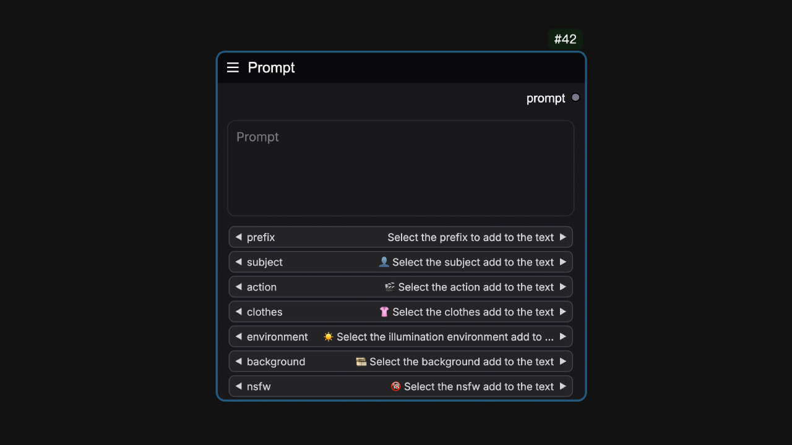
</Frame>
This node provides various categories of prompts to add to the text input by selecting them, and it is commonly used to test IClight. Content from [IClight](https://huggingface.co/spaces/lllyasviel/iclight-v2-vary)

**Name**: `easy prompt` 
**Widget**:
<ParamField path="text" type="string">
Input your prompt.
</ParamField>
<ParamField path="prefix" type="combo">
Select a prefix to add to the text.
</ParamField>
<ParamField path="subject" type="combo">
👤Select the subject add to the text.
</ParamField>
<ParamField path="action" type="combo">
🎬Select the action add to the text.
</ParamField>
<ParamField path="clothes" type="combo">
👚Select the clothes add to the text.
</ParamField>
<ParamField path="environment" type="combo">
☀️Select the illumination environment add to the text.
</ParamField>
<ParamField path="background" type="combo">
🎞️Select the background add to the text.
</ParamField>
**Output Parameters**:
<ParamField path="text" type="string">
Output the text
</ParamField>

## PromptList
<Frame>
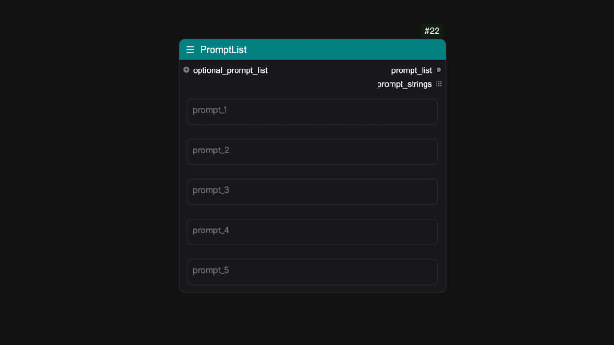
</Frame>
This node can output a list of prompts.

**Name**: `easy promptList` 
**Input Parameters**:
<ParamField path="optional_prompt_list" type="string">
Connecting to an easyPromptList. (Optional)
</ParamField>
**Widget**:
<ParamField path="prompt1" type="string">
</ParamField>
<ParamField path="prompt2" type="string">
</ParamField>
<ParamField path="prompt3" type="string">
</ParamField>
<ParamField path="prompt4" type="string">
</ParamField>
<ParamField path="prompt5" type="string">
</ParamField>
**Output Parameters**:
<ParamField path="promptList" type="LIST">
Output the lists of prompts
</ParamField>
<ParamField path="prompt_strings" type="string">
Output the lists of prompts
</ParamField>

## PromptLine
<Tabs>
  <Tab title="Node Preview">
    <Frame>
    
    </Frame>
  </Tab>
  <Tab title="Example">
      <Frame>
      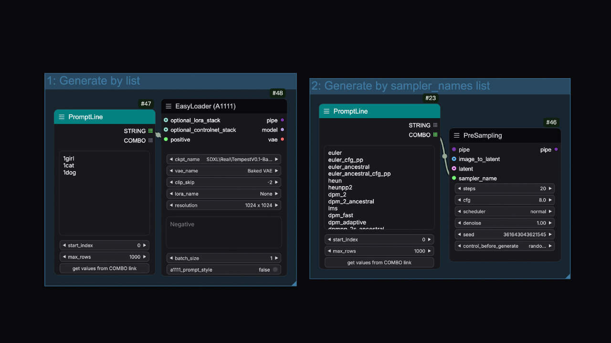
      </Frame>
  </Tab>
</Tabs>
Split by behavior, output a list of strings or combo.

**Name**: `easy promptLine` 
**Widget**:
<ParamField path="text" type="string">
Input your prompt.
</ParamField>
<ParamField path="start_index" type="int" default="0">
The start index of the prompt.
</ParamField>
<ParamField path="max_rows" type="int" default="1000">
The maximum number of rows of the prompt.
</ParamField>
<ParamField path="get values from COMBO link" type="button" >
You need to link the COMBO in the output to a node with a COMBO component first, and convert the combo component of this node into an input item.
</ParamField>
**Output Parameters**:
<ParamField path="STRING" type="string">
Output the text.
</ParamField>
<ParamField path="COMBO" type="combo">
Output the combo.
</ParamField>

## PromptConcat
<Frame>
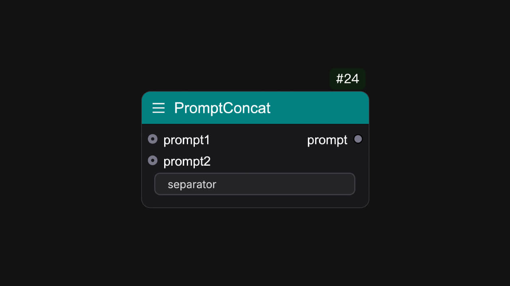
</Frame>
Concatenate two prompts into one.

**Name**: `easy promptConcat` 
**Input Parameters**:
<ParamField path="prompt1" type="string">
</ParamField>
<ParamField path="prompt2" type="string">
</ParamField>
**Widget**:
<ParamField path="separator" type="string">
Input the separator. (e.g ",")
</ParamField>
**Output Parameters**:
<ParamField path="prompt" type="string">
Output the prompt.
</ParamField>

## PromptReplace
<Frame>
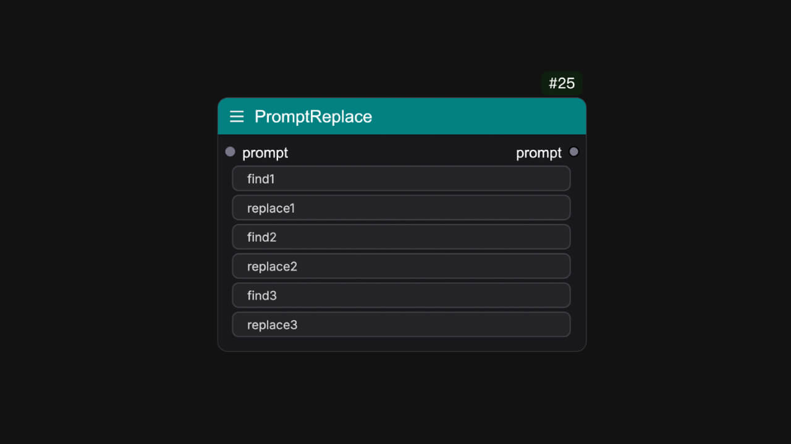
</Frame>
Replace the prompt with the specified string.

**Name**: `easy promptReplace` 
**Input Parameters**:
<ParamField path="prompt" type="string">
</ParamField>
**Widget**:
<ParamField path="find1" type="string">
Input the string you want to find.
</ParamField>
<ParamField path="replace1" type="string">
Input the string you want to replace.
</ParamField>
<ParamField path="find2" type="string">
Input the string you want to find.
</ParamField>
<ParamField path="replace2" type="string">
Input the string you want to replace.
</ParamField>
<ParamField path="find3" type="string">
Input the string you want to find.
</ParamField>
<ParamField path="replace3" type="string">
Input the string you want to replace.
</ParamField>
**Output Parameters**:
<ParamField path="prompt" type="string">
Output the prompt.
</ParamField>

## StylesSelector
<Frame>
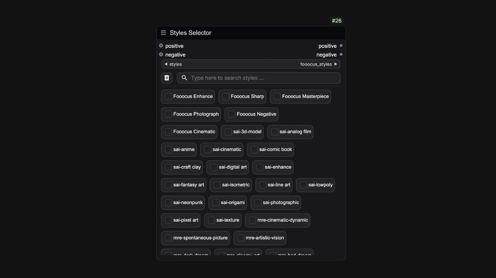
</Frame>
A styles prompt templates multiple choice node

## Portrait Master

Character prompt Node

