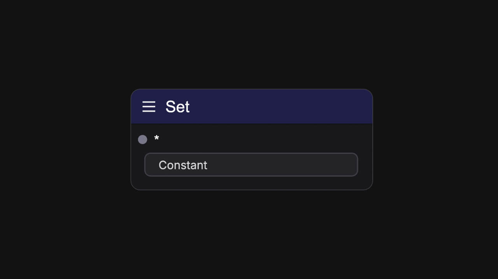
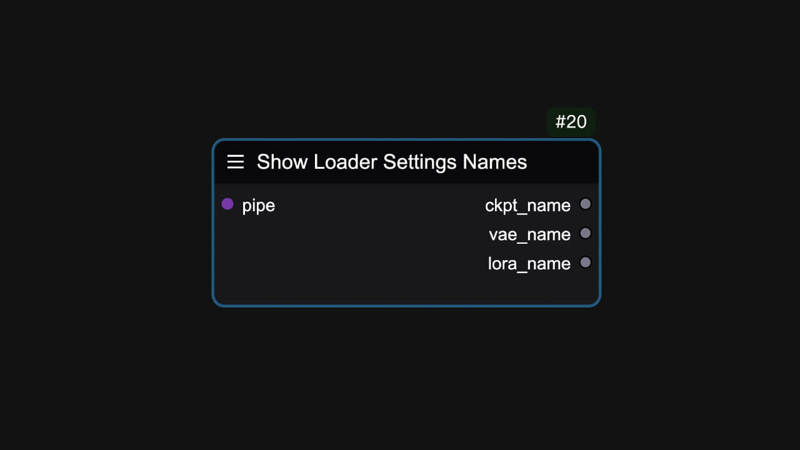
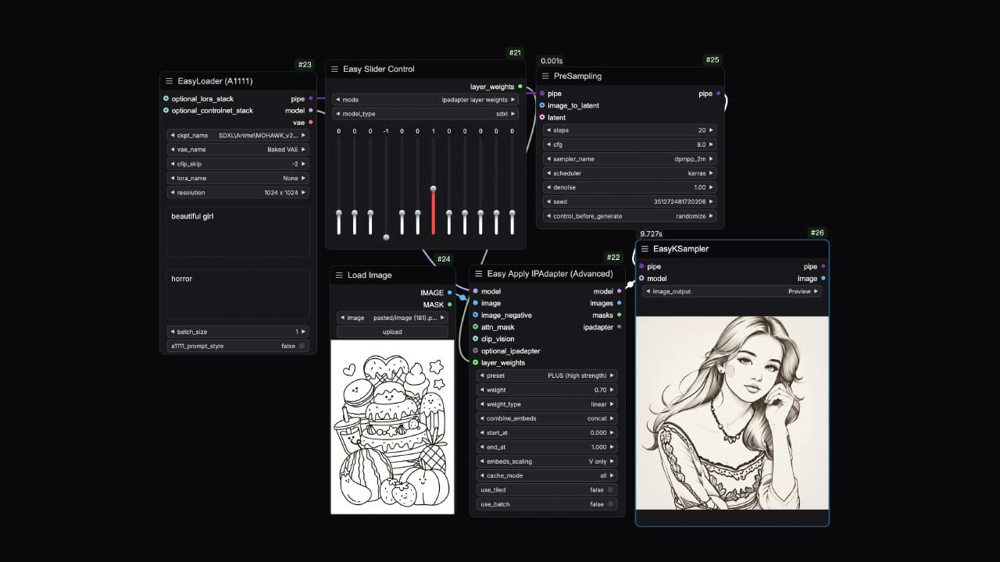

## Bookmark 🔖
<Frame caption="">

</Frame>
You can use shortcuts to quickly jump to the position on the workflow canvas.

**Name**: `easy bookmark` 
**Widget**:
<ParamField path="shortcut_key" type="string" default="1">
Set the shortcut key
</ParamField>
<ParamField path="zoom" type="float" default="1.00">
Zoom factor
</ParamField>

## SetNode
<Tabs>
  <Tab title="Node Preview">
    <Frame>
    
    </Frame>
  </Tab>
  <Tab title="Example">
      <Frame>
      
      </Frame>
  </Tab>
</Tabs>
Usually used to store a certain output parameter of the previous node, used in conjunction with `easy getNode`.

**Name**: `easy setNode` 
**Input Parameters**:
<ParamField path="*" type="any">
Any parameter type
</ParamField>
**Widget**:
<ParamField path="Constant" type="string">
Define variable name
</ParamField>

## GetNode
<Tabs>
  <Tab title="Node Preview">
    <Frame>
    
    </Frame>
  </Tab>
  <Tab title="Example">
      <Frame>
      
      </Frame>
  </Tab>
</Tabs>
Usually used to read the parameters stored in the corresponding variable, used in conjunction with `easy setNode`.

**Name**: `easy getNode` 
**Widget**:
<ParamField path="Constant" type="combo">
Select the defined variable name
</ParamField>
**Output Parameters**:
<ParamField path="*" type="any">
Output any parameter type
</ParamField>

## Show Loader Settings Names
<Tabs>
  <Tab title="Node Preview">
    <Frame>
    
    </Frame>
  </Tab>
  <Tab title="Example">
      <Frame>
      
      </Frame>
  </Tab>
</Tabs>
Display the parameter names of the loader.

**Name**: `easy showLoaderSettingsNames` 
**Input Parameters**:
<ParamField path="pipe" type="PIPE_LINE">
EasyUse Pipeline
</ParamField>
**Output Parameters**:
<ParamField path="ckpt_name" type="string">
ckpt_name
</ParamField>
<ParamField path="vae_name" type="string">
vae_name
</ParamField>
<ParamField path="lora_name" type="string">
lora_name
</ParamField>

## Slider Control
<Tabs>
  <Tab title="Node Preview">
    <Frame>
    
    </Frame>
  </Tab>
  <Tab title="Example">
      <Frame>
      
      </Frame>
  </Tab>
</Tabs>
Usually used for the mad scientist function of the ip-adapter, it provides a slider control UI for layer weight adjustment.

**Name**: `easy sliderControl` 
**Widget**:
<ParamField path="mode" type="combo" default="ipadapter layer weights">
Slider mode
</ParamField>
<ParamField path="model_type" type="combo" default="sdxl">
Model type
</ParamField>
**Output Parameters**:
<ParamField path="layer_weight" type="string">
Adjustable layer weight
</ParamField>

## Ckpt Names
Can be connected to the loader and converted to the input type of ckpt_name.

**Name**: `easy ckptNames` 
**Widget**:
<ParamField path="ckpt_name" type="combo">
Select model name
</ParamField>
**Output Parameters**:
<ParamField query="ckpt_name" type="combo">
Output the selected model name
</ParamField>

## ControlNet Names
Can be connected to the ControlNet loader and converted to the input type of controlnet_name.

**Name**: `easy ckptNames` 
**Widget**:
<ParamField path="controlnet_name" type="combo">
Select ControlNet model name
</ParamField>
**Output Parameters**:
<ParamField query="controlnet_name" type="combo">
Output the selected ControlNet model name
</ParamField>