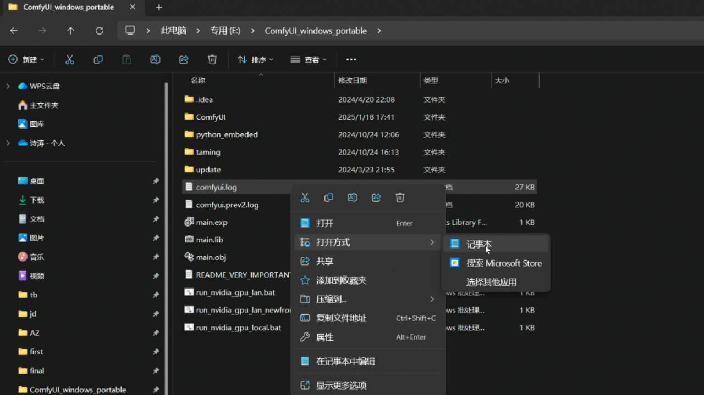
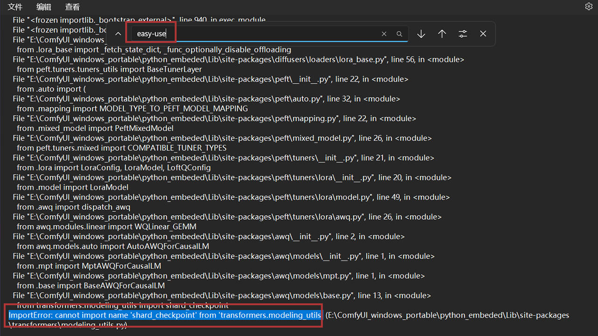
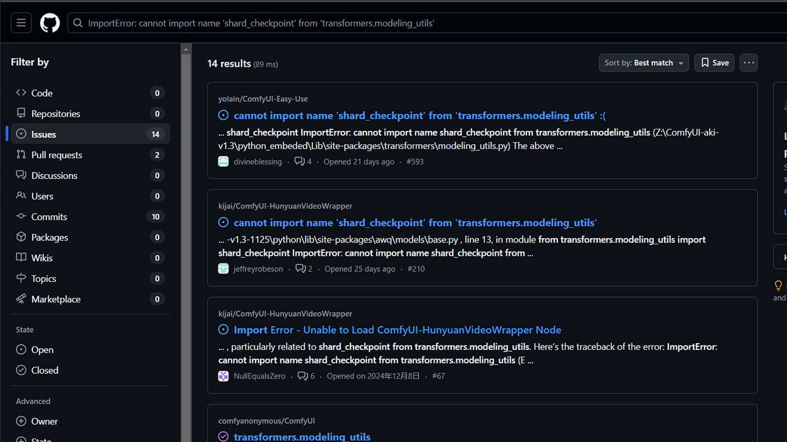

<Steps>
  <Step title="安装节点包" >
    <AccordionGroup>
      <Accordion title="通过Git命令安装">
        #### 1.安装 Git
        如果您的电脑上没有安装Git，请先安装Git。Git是一个分布式版本控制系统，用于跟踪文件的更改。您可以在[Git官网](https://git-scm.com/downloads)下载适合您操作系统的Git安装包。

        #### 2.克隆 EasyUse 到本地
        <Tabs>
          <Tab title="Windows">
            - 进入 ` ComfyUI/custom_nodes` 文件夹
            - 在文件夹上方搜索框 输入 `cmd` 回车启动命令行工具
            - 在命令行工具中输入以下命令下载EasyUse节点包
            ```shell
            git clone https://github.com/yolain/ComfyUI-Easy-Use
            ```
          </Tab>
          <Tab title="Linux（云平台）">
            - 进入 ` ComfyUI/custom_nodes` 文件夹
            - 在右侧面板中找到命令行/终端工具
            - 输入以下命令下载EasyUse节点包
            ```shell
            git clone https://github.com/yolain/ComfyUI-Easy-Use
            ```
          </Tab>
          <Tab title="MacOS">
            - 在 ` 应用程序/其他` 或 `聚焦搜索` 中运行终端
            - 找到 ` ComfyUI/custom_nodes` 文件夹, `Option` + `Command` + `C` 复制路径
            - 输入以下命令下载EasyUse节点包
            ```shell
            # 请将路径粘贴到 cd 后
            cd 路径
            git clone https://github.com/yolain/ComfyUI-Easy-Use
            ```
          </Tab>
        </Tabs>
      </Accordion>
      <Accordion title="通过ComfyUI管理器安装" >
        - 运行 ComfyUI 后，在 web 界面上方点击 `Manager` 找到 `Custom Nodes Manager`
        - 搜索 `ComfyUI Easy Use` 并点击 `Install`
        - 重启 ComfyUI 以使更改生效
      </Accordion>
      <Accordion title="通过第三方启动器安装" >
        - 运行第三方启动器，如 `秋叶启动器`
        - 在启动器的节点管理中搜索 `ComfyUI Easy Use` 并点击 `Install`
      </Accordion>
    </AccordionGroup>
  </Step>

  <Step title="安装所需依赖" >
      <Note>有些云平台（Linux环境）使用的是Miniconda，如需要更新依赖，请参考第三种方案。</Note>
      <AccordionGroup>
        <Accordion title="官方Desktop版本">
          无需安装额外依赖，官方已内置了所有所需依赖
        </Accordion>
        <Accordion title="系统Python 或 ComfyUI_windows_portable 或 整合包">
            <Tabs>
              <Tab title="Windows">
                - 进入 ` ComfyUI/custom_nodes/ComfyUI-Easy-Use` 文件夹
                - 运行 `install.bat` 文件 安装依赖
              </Tab>
              <Tab title="Linux/MacOS">
                - 在 ` 应用程序/其他` 或 `聚焦搜索` 中运行终端
                - 找到 ` ComfyUI/custom_nodes` 文件夹, `Option` + `Command` + `C` 复制路径
                - 输入以下命令安装依赖
                ```shell
                # 请将路径粘贴到 cd 后
                cd 路径
                sh ./install.sh
                ```
              </Tab>
            </Tabs>
        </Accordion>
        <Accordion title="Miniconda / Anaconda">
          <Tabs>
            <Tab title="Windows">
              - 进入 ` ComfyUI/custom_nodes` 文件夹
              - 在文件夹上方搜索框 输入 `cmd` 回车启动命令行工具
              - 输入以下命令激活conda虚拟环境，并安装依赖
              ```shell
                # 以当前虚拟环境名称为 comfyui 为例
                conda activate comfyui
                pip install -r requirements.txt
              ```
            </Tab>
            <Tab title="Linux/MacOS">
              - 在 ` 应用程序/其他` 或 `聚焦搜索` 中运行终端
              - 找到 ` ComfyUI/custom_nodes` 文件夹, `Option` + `Command` + `C` 复制路径
              - 输入以下命令激活conda虚拟环境，并安装依赖
              ```shell
                # 以当前虚拟环境名称为 comfyui 为例
                conda activate comfyui
                pip install -r requirements.txt
              ```
            </Tab>
          </Tabs>
        </Accordion>
      </AccordionGroup>
  </Step>

  <Step title="解决依赖冲突（非必要）" >
    如果您在前两步安装完成后，运行ComfyUI本体，EasyUse仍未加载成功，一般情况下都为依赖冲突导致，您可以尝试以下方法排查问题原因：

    `1. 排查ComfyUI运行日志`
     - 运行ComfyUI后，在根目录里可以找到 `comfyui.log`、`comfyui.prev.log` 文件，使用记事本打开，查找是否有关于Easy-Use的报错信息（其他节点包问题同此方法）
     <Frame caption="1-1. 使用记事本打开更目录下的comfyui.log文件">
     
     </Frame>
     <br/>
     <Frame caption="1-2. 此处仅为各个节点包的启动结果，可以看到EasyUse加载失败，但未能查看到原因">
     
     </Frame>
     <br/>
     <Frame caption="1-3. 搜索easy-use查找相关报错原因，复制报错内容">
     
     </Frame>
    `2. 在Github中搜索相关问题 或 询问GPT 或 向开发者Github提问`
     <Frame caption="2-1. 在Github中搜索相关issue">
     
     </Frame>
     <br/>
     <Frame caption="2-2. 查找到解决方案，需要更新 `peft` 依赖">
     
     </Frame>


  </Step>

</Steps>