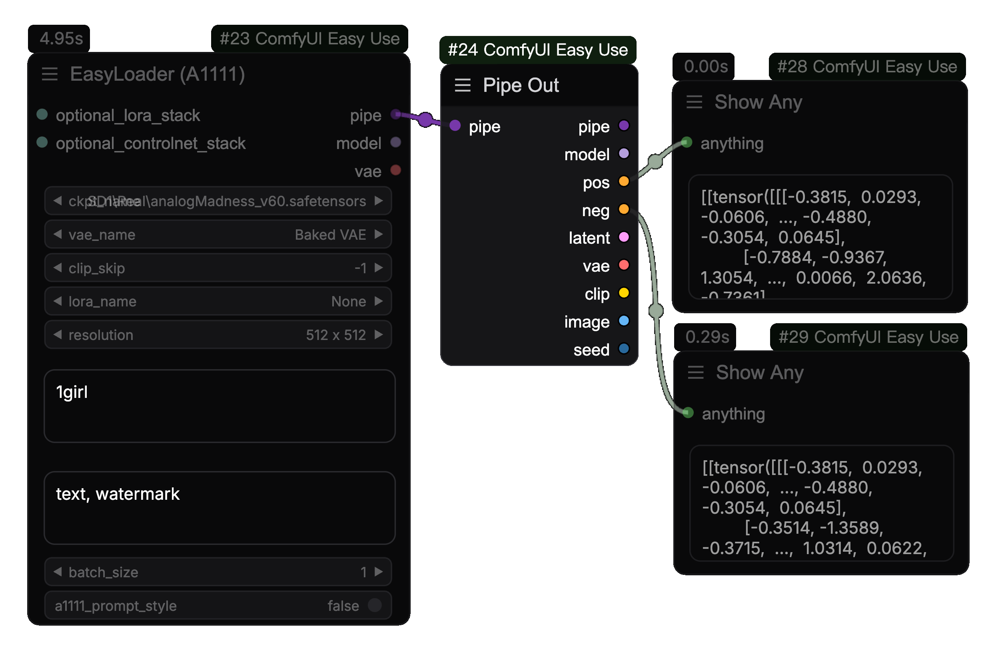
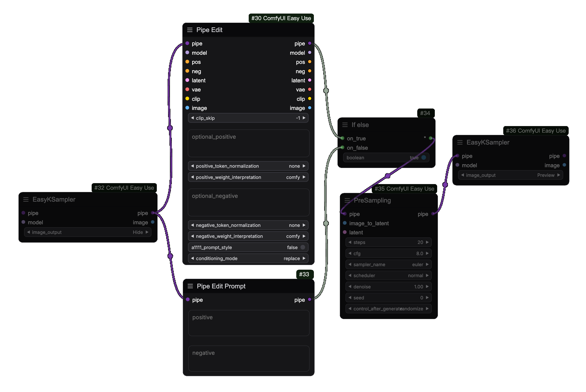

<Frame caption="使用ComfyUI-Easy-Use节点包进行简单的文生图">

</Frame>
[ComfyUI-Easy-Use](https:github.comyolaincomfyui-easy-use)是一个高效的自定义节点集成包，它是在[TinyTerraNodes](https:github.comTinyTerraComfyUI_tinyterraNodes)的基础上扩展的。对很多流行的牛逼自定义节点进行了集成和优化，以达到更快、更方便使用ComfyUI的目的。在保证自由度的同时，还原了属于Stable Diffusion的极致流畅的图像制作体验。
<CardGroup cols={2}>
<Card title="如何安装" icon="download" href="./installation">
学习如何安装ComfyUI-Easy-Use
</Card>
<Card title="快捷键使用" icon="keyboard" color="#f7b245" href="./hotkey">
通过快捷键来制作工作流
</Card>
<Card title="切换节点" icon="retweet" color="#ff6eeb" href="./swap">
同类型节点可切换一览
</Card>
<Card title="节点介绍" icon="code" color="#55D799" href="../nodes/loaders">
详细学习更多节点
</Card>
</CardGroup>

## 🧐 Easy Pipeline 和 原生流程 有什么不同？
这里所指的pipeline (管道节点束) 与 diffusers 所指的管道不同。 Easyuse 的 pipeline 只是原生节点的集成优化，使用同样舒适的原生架构。

### 1️⃣ 文生图片  (T2I)
<Tabs>
  <Tab title="原生流程">
  <Note>你需要通过7个节点来实现它。</Note>
  ```mermaid
    flowchart LR
      CKPT[Checkpoint加载器] -- clip --> TE[CLIP文本编码器] -- 条件 --> K采样器
      CKPT[Checkpoint加载器] -- clip --> TE2[CLIP文本编码器] -- 条件 --> K采样器
      CKPT[Checkpoint加载器] -- 模型 --> K采样器
      CKPT[Checkpoint加载器] -- vae --> VD[VAE解码]
      EmptyLatent[Empty Latent] -- latent --> K采样器
      K采样器 -- latent --> VD[VAE解码]
      VD[VAE解码] -- images --> 预览/保存
  ```
  </Tab>
  <Tab title="EasyUse的管道节点流">
  <Note>您仅需要2-3个节点来实现它。<br/>一般来说，使用 方法2 更有利于工作流程的制作。</Note>
  ```mermaid
    flowchart TB
      subgraph Method2
        direction LR
        EL["简易加载器 (*)"] -- pipe --> EPK["预采样参数"] -- pipe --> EK["简易采样器"]
      end
      subgraph Method1
        direction LR
        ELF["简易加载器 (Full)"] -- pipe --> EKF["EasyKSampler (Full)"]
      end
  ```

  **简易加载器**: 加载检查点模型和对文本进行编码并设置一个空的潜在空间。您还可以在此处使用加载lora模型并设置CLIP层跳过。 [查看所有加载器节点](../nodes/loaders)<br />
  **预采样参数**: 这是一个从采样器分割出来的节点, 只配置采样参数，不进行采样. [查看所有预采样节点](../nodes/preSampling)<br />
  **简易采样器**: 只进行采样和vae解码，采样参数从预采样节点传入，更容易观察去噪过程。 [查看所有采样器节点](../nodes/kSamplers)<br />

  </Tab>
</Tabs>

### 2️⃣ 图片生成图片  (I2I)
<Tabs>
  <Tab title="原生流程">
  ```mermaid
    flowchart LR
      CKPT[Checkpoint加载器] -- clip --> TE[CLIP文本编码器] -- 条件 --> K采样器
      CKPT[Checkpoint加载器] -- clip --> TE2[CLIP文本编码器] -- 条件 --> K采样器
      CKPT[Checkpoint加载器] -- 模型 --> K采样器
      CKPT[Checkpoint加载器] -- vae --> VD[VAE解码]
      LM[加载图片] -- vae --> VE[VAE编码] -- latent --> K采样器
      K采样器 -- latent --> VD[VAE解码]
      VD[VAE解码] -- images --> 预览/保存
  ```
  </Tab>
  <Tab title="EasyUse的管道节点流">
  ```mermaid
    flowchart LR
      EL["简易加载器 (*)"] -- pipe --> EPK["预采样参数"] -- pipe --> EK["简易采样器"]
      LM[加载图片] -- image --> EPK["预采样参数"]
  ```
  预采样将 加载图片 节点传入的像素图像转换为潜在空间图像
  </Tab>
</Tabs>

### 3️⃣ 使用Controlnet
<Tabs>
  <Tab title="原生流程">
  ```mermaid
    flowchart LR
      CKPT[Checkpoint加载器] -- clip --> TE[CLIP文本编码器]
      CKPT[Checkpoint加载器] -- clip --> TE2[CLIP文本编码器]
      TE -- 条件 --> CN[Apply ControlNet] -- 条件 --> K采样器
      TE2 -- 条件 --> CN[Apply ControlNet]
      EmptyLatent[Empty Latent] -- latent --> K采样器
      CNL[ControlNet Loader] -- controlnet --> CN[Apply ControlNet]
      LM[加载图片] -- image --> PE[预处理] -- image --> CN[Apply ControlNet]
      CKPT[Checkpoint加载器] -- 模型 --> K采样器
      CKPT[Checkpoint加载器] -- vae --> VD[VAE解码]
      K采样器 -- latent --> VD[VAE解码]
      VD[VAE解码] -- images --> 预览
  ```
  </Tab>
  <Tab title="EasyUse的管道节点流">
  ```mermaid
      flowchart LR
        subgraph Method3
          direction LR
          LM3[加载图片] -- image --> PE3[预处理] -- image --> EC3[ControlNet堆] -- cnet_stack --> ACN["ApplyControlNet堆"]
          EL3["简易加载器 (*)"] -- pipe --> ACN["ApplyControlNet堆"] -- pipe --> EPK3["预采样参数"] -- pipe --> EK3["简易采样器"]
        end
        subgraph Method2
          direction LR
          LM[加载图片] -- image --> PE[预处理] -- image --> EC[ControlNet堆] -- optional_controlnet --> EL["简易加载器 (*)"]
          EL["简易加载器 (*)"] -- pipe --> EPK["预采样参数"] -- pipe --> EK["简易采样器"]
        end
        subgraph Method1
          direction LR
          LM2[加载图片] -- image --> PE2[预处理] -- image --> EC2["Easy ControlNet"]
          EL2["简易加载器 (*)"] -- pipe --> EC2["Easy ControlNet"] -- pipe --> EPK2["预采样参数"] -- pipe --> EK2["简易采样器"]
        end
    ```
  </Tab>
</Tabs>


## 🧐如何合并或拆解节点束?  (Pipe)

### 节点束输入  (Pipe In)

您可以使用 `节点束输入` 将一些常规输出合并到管道中


### 节点束输出  (Pipe Out)
您可以使用 `节点束输出` 将一些常规输出从节点束拆解出来


### 节点束编辑  (Pipe Edit)
使用 `节点束编辑` or `节点束编辑提示词` 来编辑节点束

通常，它用于在第一次扩散后保留一些参数。对于第二次扩散我们只需要修改一些参数并改变预采样参数。
