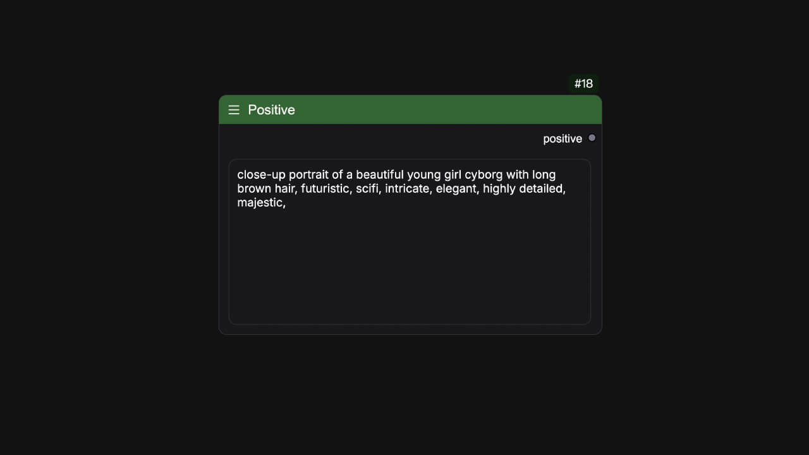
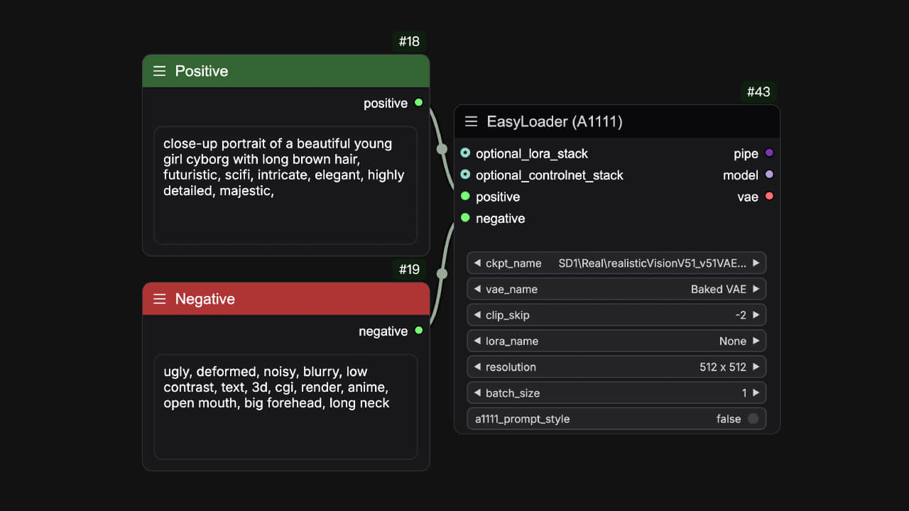
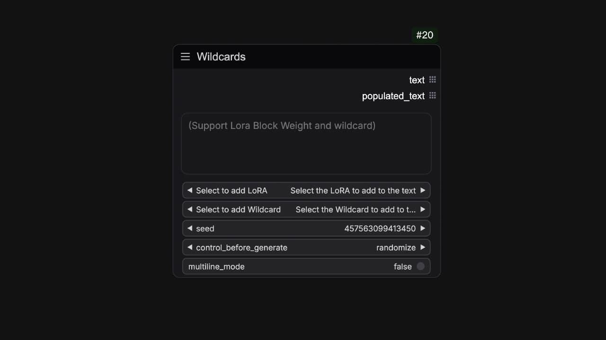
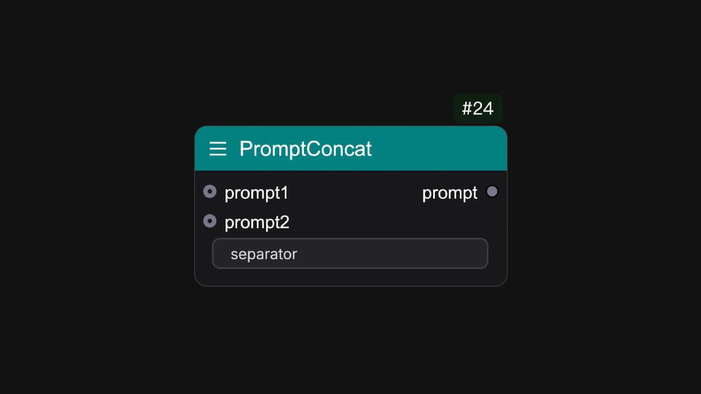

## 正面提示词 (Positive)
<Tabs>
  <Tab title="节点预览">
    <Frame>
    
    </Frame>
  </Tab>
  <Tab title="示例">
      <Frame>
      
      </Frame>
  </Tab>
</Tabs>
这是一个简单的文本节点，可以用作任何文本输入。为了更好地区分正面和负面提示词，它默认标记为绿色，以便它可以作为正面提示词。

**名称**: `easy positive` 
**小部件**:
<ParamField path="positive" type="string">
输入你的文本
</ParamField>
**输出参数**:
<ParamField path="正面提示词" type="string">
输出你的文本
</ParamField>

## 负面提示词 (Negative)
<Tabs>
  <Tab title="节点预览">
    <Frame>
    
    </Frame>
  </Tab>
  <Tab title="示例">
      <Frame>
      
      </Frame>
  </Tab>
</Tabs>
这也是一个简单的文本节点，可以用作任何文本输入。为了更好地区分正面和负面提示词，它默认标记为红色，以便它可以作为负面提示词。

**名称**: `easy negative` 
**小部件**:
<ParamField path="negative" type="string">
输入你的文本
</ParamField>
**输出参数**:
<ParamField path="负面提示词" type="string">
输出你的文本
</ParamField>

## 通配符提示词 (Wildcards)
<Tabs>
  <Tab title="节点预览">
    <Frame>
    
    </Frame>
  </Tab>
  <Tab title="示例">
      <Frame>
      
      </Frame>
  </Tab>
</Tabs>
你可以将随机种子与在通配符文件夹中创建的通配符模板关联，以获得随机提示词。当然，这个节点也支持lora提示语法。 

**名称**: `easy wildcards` 
**小部件**:
<ParamField path="text" type="string">
输入你的提示词，并支持一些关于通配符和lora格式词语的语法。
| 支持的语法 | 描述 |
| --- | --- |
| \<lora:add-detail-xl\> | \<lora:lora_name\> 它将根据lora_name加载，模型权重为1.0  |
| \<lora:add-detail-xl:0.5\> | \<lora:lora_name:weight\> 它将根据lora_name加载，模型权重为0.5  |
| \<lora:add-detail-xl:LBW=0,1,1,1,1,1,0,0,0,1,1,1\> | \<lora:lora_name:LBW=lora_block_weight\> 它将根据lora_name加载，并通过lora_block_weight设置lora层权重。 |
| \_\_example\_\_ | \_\_wildcard\_\_ 它将\_\_wildcard\_\_转换为填充词 |
</ParamField>
<ParamField path="选择添加LoRA" type="combo">
将要添加的LoRA转换为提示词格式并添加到文本中。 
</ParamField>
<ParamField path="选择添加Wildcard" type="combo">
将要添加的通配符转换为提示词格式并添加到文本中。 
</ParamField>
<ParamField path="随机种" type="int|seed">
Comfy的常规种子小部件。
</ParamField>
<ParamField path="多行模式" type="boolean">
启用后，字符串的每一行将通过排列行分割形成字符串列表。
</ParamField>
**输出参数**:
<ParamField path="提示词" type="string">
未填充的文本，你需要将其连接到easy pipeline相关的流程。
</ParamField>
<ParamField path="通配填充词" type="string">
填充的文本，你可以将其用作任何流程的提示词。
</ParamField>

## 提示词 (Prompt)
<Frame>
    
</Frame>
此节点提供各种类别的提示词，通过选择它们添加到文本输入中，通常用于测试IClight。内容来自[IClight](https://huggingface.co/spaces/lllyasviel/iclight-v2-vary)

**名称**: `easy prompt` 
**小部件**:
<ParamField path="text" type="string">
输入你的提示词。
</ParamField>
<ParamField path="prefix" type="combo">
选择一个前缀添加到文本中。
</ParamField>
<ParamField path="subject" type="combo">
👤选择要添加到文本中的主题。
</ParamField>
<ParamField path="action" type="combo">
🎬选择要添加到文本中的动作。
</ParamField>
<ParamField path="clothes" type="combo">
👚选择要添加到文本中的衣服。
</ParamField>
<ParamField path="environment" type="combo">
☀️选择要添加到文本中的照明环境。
</ParamField>
<ParamField path="background" type="combo">
🎞️选择要添加到文本中的背景。
</ParamField>
**输出参数**:
<ParamField path="text" type="string">
输出文本
</ParamField>

## 提示词列表 (PromptList)
<Frame>

</Frame>
此节点可以输出提示词列表。

**名称**: `easy promptList` 
**输入参数**:
<ParamField path="列表（可选）" type="string">
连接到一个easyPromptList。（可选）
</ParamField>
**小部件**:
<ParamField path="prompt1" type="string">
</ParamField>
<ParamField path="prompt2" type="string">
</ParamField>
<ParamField path="prompt3" type="string">
</ParamField>
<ParamField path="prompt4" type="string">
</ParamField>
<ParamField path="prompt5" type="string">
</ParamField>
**输出参数**:
<ParamField path="列表" type="LIST">
输出提示词列表
</ParamField>
<ParamField path="prompt_strings" type="string">
输出提示词列表
</ParamField>

## 提示词行 (PromptLine)
<Tabs>
  <Tab title="节点预览">
    <Frame>
    
    </Frame>
  </Tab>
  <Tab title="示例">
      <Frame>
      
      </Frame>
  </Tab>
</Tabs>
按行为拆分，输出字符串列表或组合。

**名称**: `easy promptLine` 
**小部件**:
<ParamField path="text" type="string">
输入你的提示词。
</ParamField>
<ParamField path="start_index" type="int" default="0">
提示词的起始索引。
</ParamField>
<ParamField path="max_rows" type="int" default="1000">
提示词的最大行数。
</ParamField>
<ParamField path="get values from COMBO link" type="button" >
你需要先将输出中的COMBO链接到具有COMBO组件的节点，并将此节点的COMBO组件转换为输入项。
</ParamField>
**输出参数**:
<ParamField path="STRING" type="string">
输出文本。
</ParamField>
<ParamField path="COMBO" type="combo">
输出组合。
</ParamField>

## 提示词连接 (PromptConcat)
<Frame>

</Frame>
将两个提示词连接成一个。

**名称**: `easy promptConcat` 
**输入参数**:
<ParamField path="提示词1" type="string">
</ParamField>
<ParamField path="提示词2" type="string">
</ParamField>
**小部件**:
<ParamField path="间隔符" type="string">
输入分隔符。（例如 ","）
</ParamField>
**输出参数**:
<ParamField path="提示词" type="string">
输出提示词。
</ParamField>

## 提示词替换 (PromptReplace)
<Frame>

</Frame>
用指定的字符串替换提示词。

**名称**: `easy promptReplace` 
**输入参数**:
<ParamField path="提示词" type="string">
</ParamField>
**小部件**:
<ParamField path="搜索_1" type="string">
输入你要查找的字符串。
</ParamField>
<ParamField path="替换_1" type="string">
输入你要替换的字符串。
</ParamField>
<ParamField path="搜索_2" type="string">
输入你要查找的字符串。
</ParamField>
<ParamField path="替换_2" type="string">
输入你要替换的字符串。
</ParamField>
<ParamField path="搜索_3" type="string">
输入你要查找的字符串。
</ParamField>
<ParamField path="替换_3" type="string">
输入你要替换的字符串。
</ParamField>
**输出参数**:
<ParamField path="提示词" type="string">
输出提示词。
</ParamField>

## 样式选择器 (StylesSelector)
<Frame>

</Frame>
一个样式提示词模板多选节点

## 人像大师 (PortraitMaster)

角色提示词节点

