## 书签 🔖  (Bookmark)
<Frame caption="">
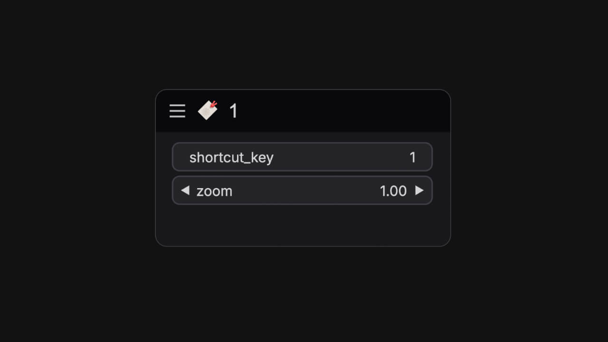
</Frame>
可以使用快捷键在工作流画布间快速跳转所处画面的位置。

**节点名**：`easy bookmark` 
**部件参数 (Widgets)**：
<ParamField path="shortcut_key" type="string" default="1">
设置的快捷键
</ParamField>
<ParamField path="zoom" type="float" default="1.00">
缩放系数
</ParamField>

## 设置点  (SetNode)
<Tabs>
  <Tab title="节点预览">
    <Frame>
    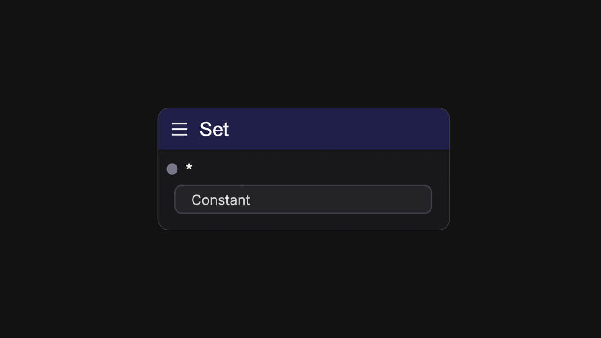
    </Frame>
  </Tab>
  <Tab title="使用示例">
      <Frame>
      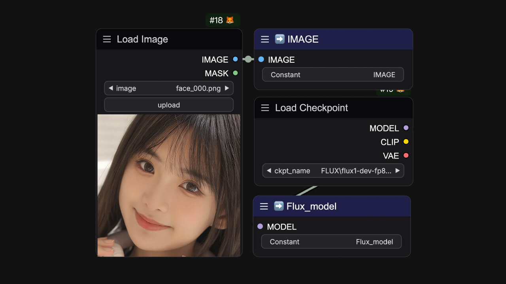
      </Frame>
  </Tab>
</Tabs>
通常用于存储上一个节点的某一个输出参数，与 `easy getNode`配合使用。

**节点名**： `easy setNode` 
**输入参数 (Input)**：
<ParamField path="*" type="any">
任意参数类型
</ParamField>
**部件参数 (Widgets)**：
<ParamField path="Constant" type="string">
定义变量名称
</ParamField>

## 获取点  (GetNode)
<Tabs>
  <Tab title="节点预览">
    <Frame>
    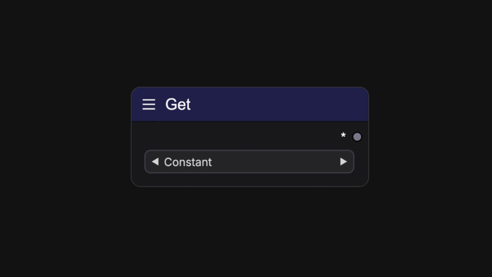
    </Frame>
  </Tab>
  <Tab title="使用示例">
      <Frame>
      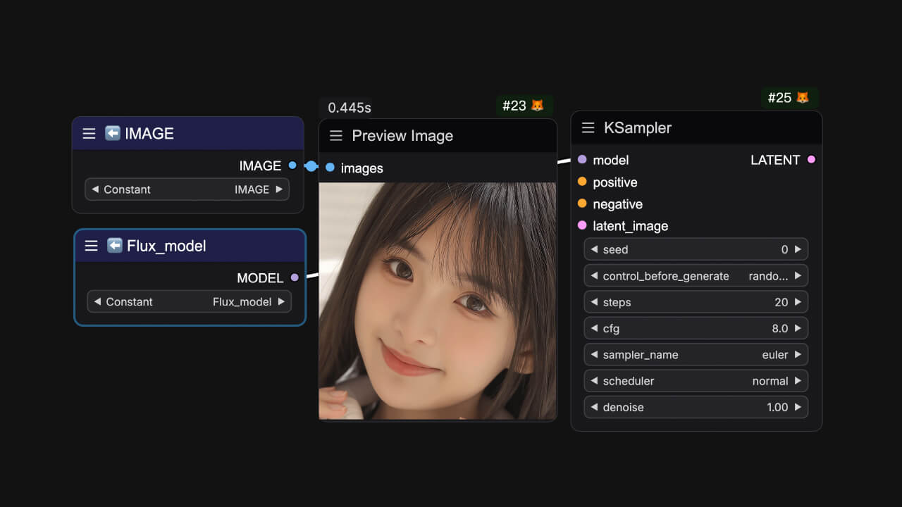
      </Frame>
  </Tab>
</Tabs>
通常用于读取对应变量中存储的参数，与 `easy setNode`配合使用。

**节点名**： `easy getNode` 
**部件参数 (Widgets)**：
<ParamField path="Constant" type="combo">
选择已定义的变量名称
</ParamField>
**输出参数 (Output)**：
<ParamField path="*" type="any">
输出任意参数类型
</ParamField>

## 显示加载器参数名称 (Show Loader Settings Names)
<Tabs>
  <Tab title="节点预览">
    <Frame>
    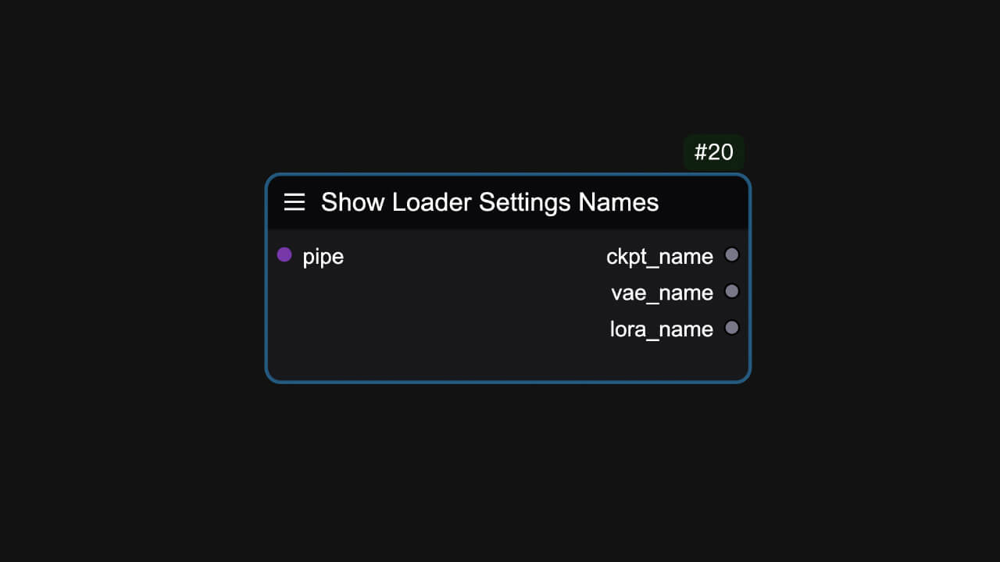
    </Frame>
  </Tab>
  <Tab title="使用示例">
      <Frame>
      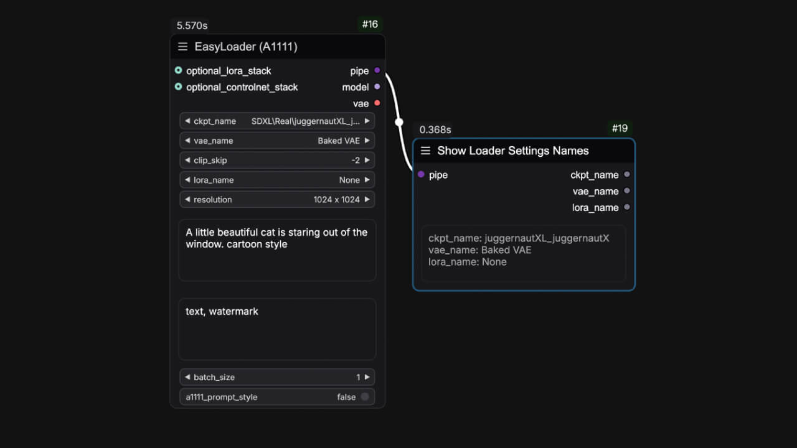
      </Frame>
  </Tab>
</Tabs>
显示加载器的参数名称。

**节点名**： `easy showLoaderSettingsNames` 
**输入参数 (Input)**：
<ParamField path="pipe" type="PIPE_LINE">
节点束
</ParamField>
**输出参数 (Output)**：
<ParamField path="模型名称" type="string">
ckpt_name
</ParamField>
<ParamField path="VAE名称" type="string">
vae_name
</ParamField>
<ParamField path="LORA名称" type="string">
lora_name
</ParamField>

## 滑条面板 (Slider Control)
<Tabs>
  <Tab title="节点预览">
    <Frame>
    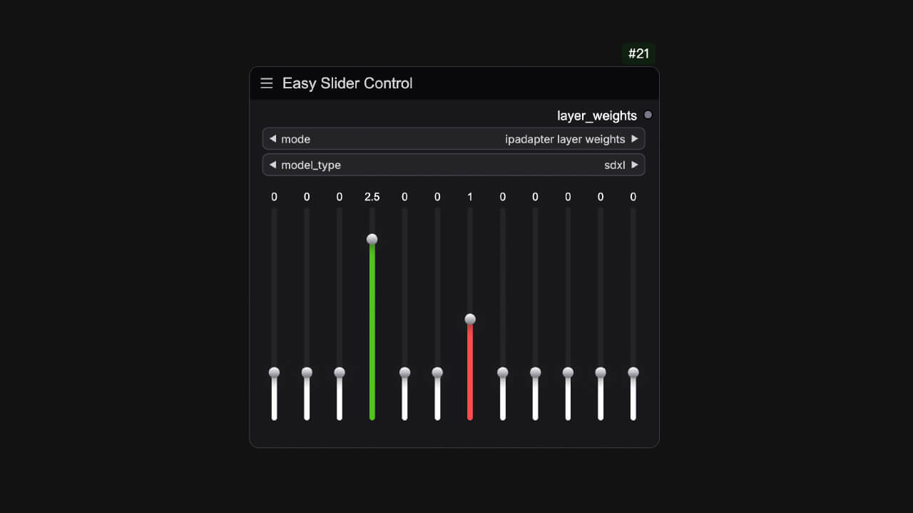
    </Frame>
  </Tab>
  <Tab title="使用示例">
      <Frame>
      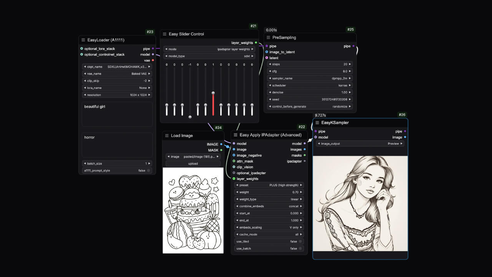
      </Frame>
  </Tab>
</Tabs>
通常用于 ip-adapter的疯狂科学家功能，它为层权重调节提供了一个滑块控制的UI。

**节点名**： `easy sliderControl` 
**部件参数 (Widgets)**：
<ParamField path="模式" type="combo" default="ipadapter layer weights">
滑块模式
</ParamField>
<ParamField path="模型类型" type="combo" default="sdxl">
模型类型
</ParamField>
**输出参数 (Output)**：
<ParamField path="层权重" type="string">
可调层的权重
</ParamField>

## Ckpt名称列表  (Ckpt Names)
<Tabs>
  <Tab title="节点预览">
    <Frame>
    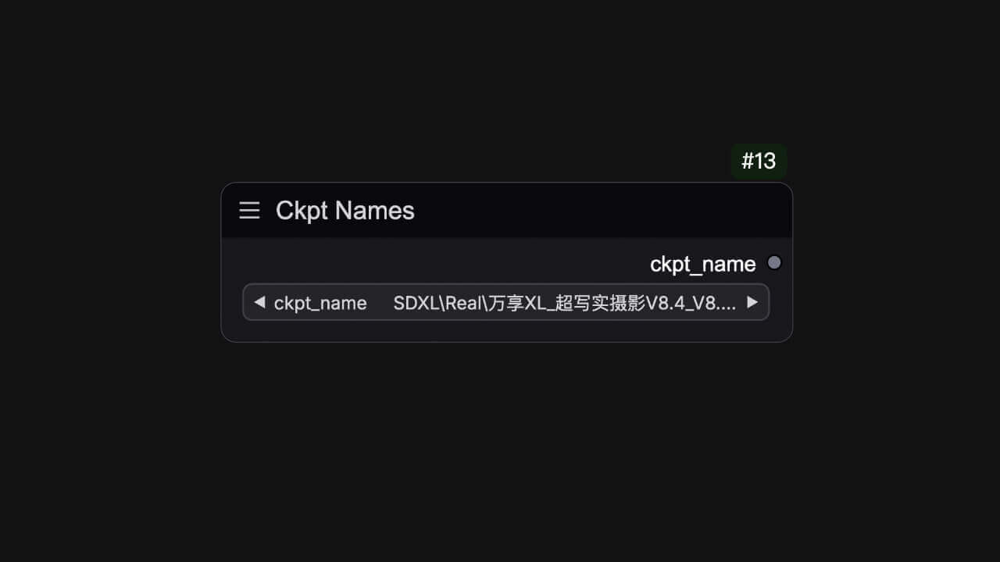
    </Frame>
  </Tab>
  <Tab title="使用示例">
      <Frame>
      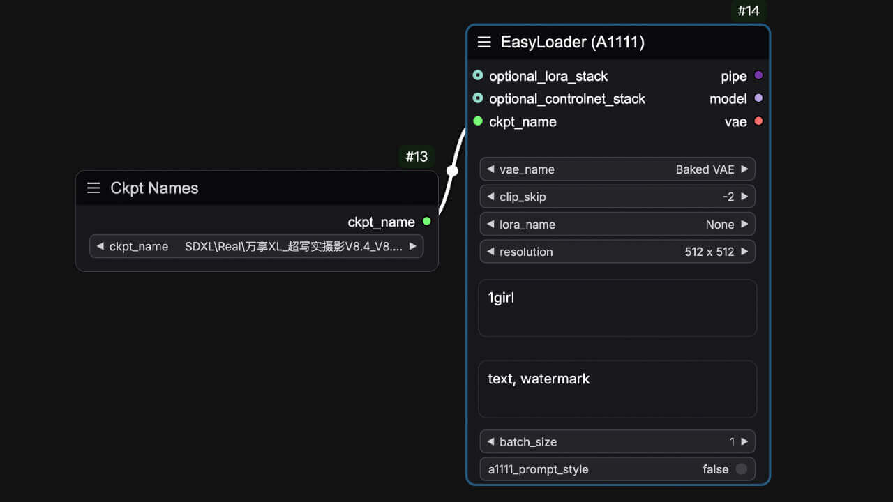
      </Frame>
  </Tab>
</Tabs>
可连接到加载器中转换为输入类型的 ckpt_name。

**节点名**: `easy ckptNames` 
**部件参数 (Widgets)**：
<ParamField path="模型名称" type="combo">
选择模型名称
</ParamField>
**输出参数 (Output)**：
<ParamField query="模型名称" type="combo">
输出已选择好的模型名称
</ParamField>

## ControlNet名称列表  (ControlNet Names)
可连接到 ControlNet 加载器中转换为输入类型的 controlnet_name。

**节点名**: `easy ckptNames` 
<Tabs>
  <Tab title="节点预览">
    <Frame>
    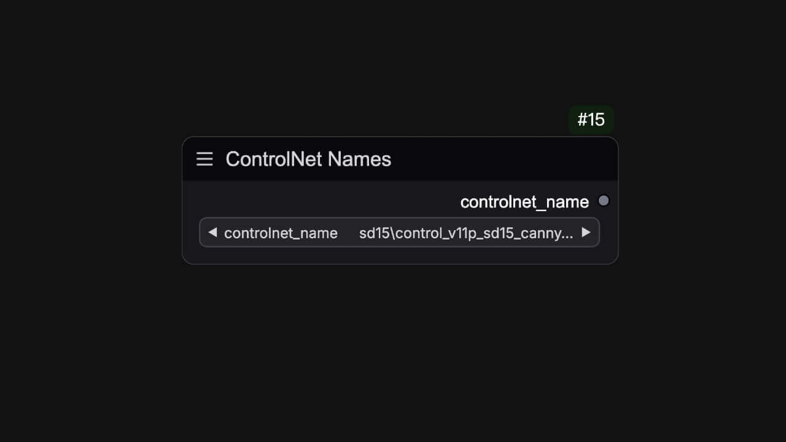
    </Frame>
  </Tab>
  <Tab title="使用示例">
      <Frame>
      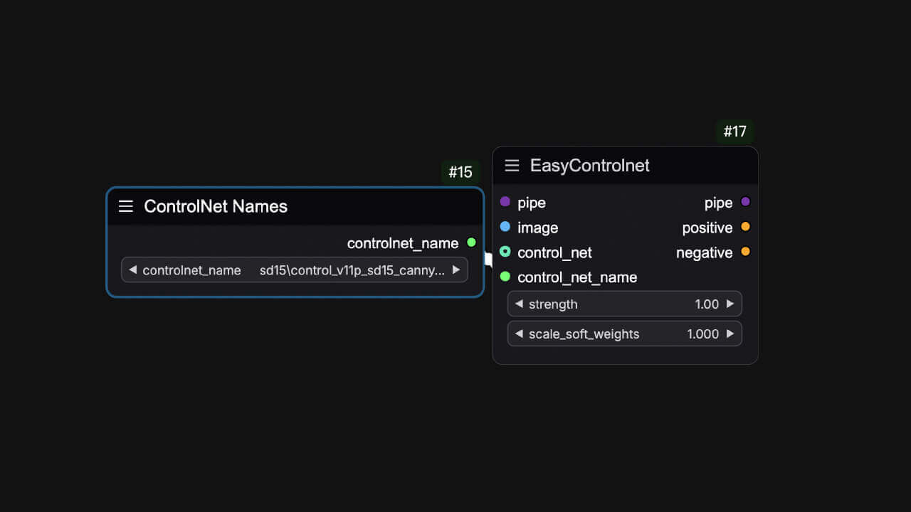
      </Frame>
  </Tab>
</Tabs>
**部件参数 (Widgets)**：
<ParamField path="ControlNet名称" type="combo">
选择ControlNet模型名称
</ParamField>
**输出参数 (Output)**：
<ParamField query="ControlNet名称" type="combo">
输出已选择好的ControlNet模型名称
</ParamField>